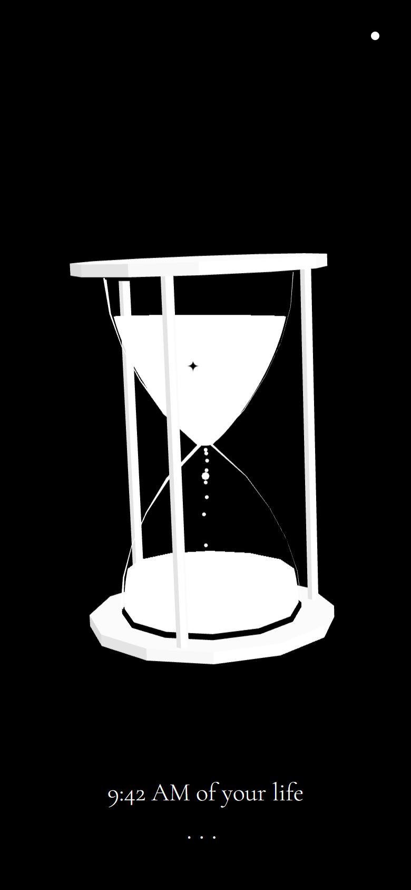
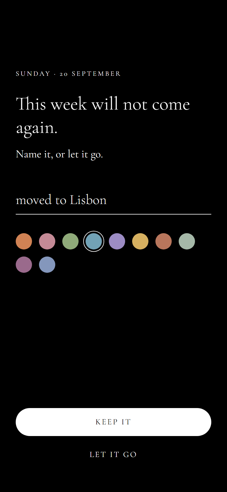
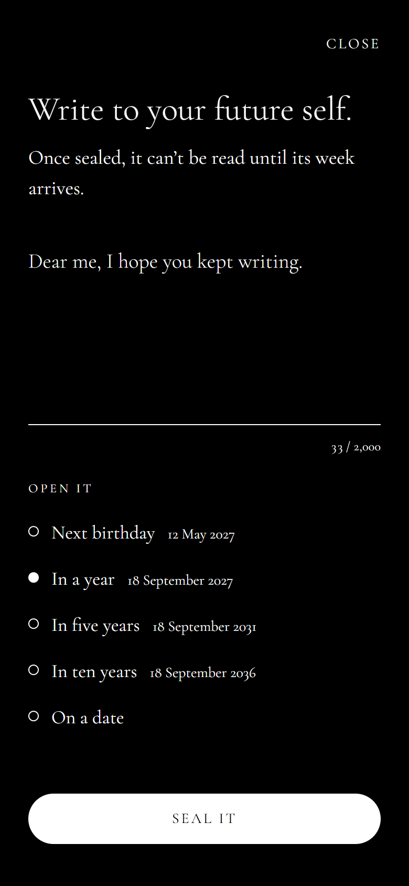
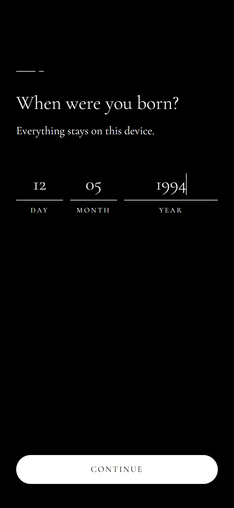
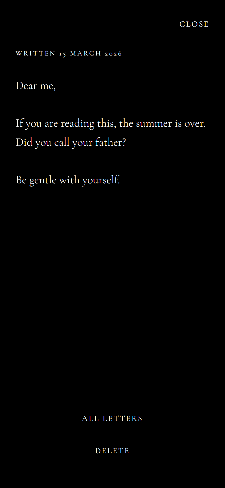
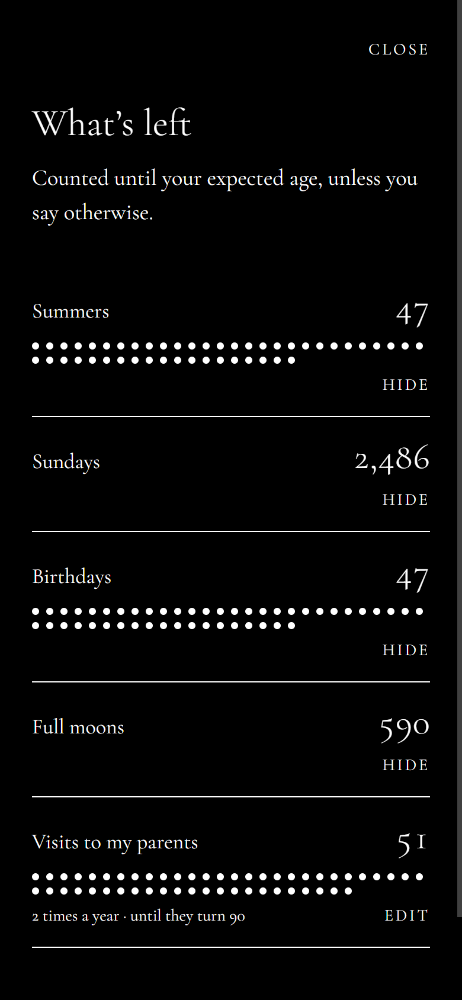

# Memento Mori

**Remember that you will die.** A quiet, mobile-first web app that shows the time you have left as a slowly turning 3D hourglass, and asks you, once a week, what that week was.

**[Open the app →](https://mementomori-app.vercel.app)** · Installable, works offline, and everything stays on your device.

<p align="center">
  
  
  
</p>

## The idea

Most "life in weeks" apps show a static grid of 4,000 boxes. This one is a low-poly 3D hourglass that turns slowly on its own and leans when you drag it or tilt your phone, and it's built around a few rules:

- **The sand is honest.** The top bulb holds exactly the share of your expected life that remains, measured by volume rather than height. A grain falls every second as a heartbeat, but the levels always come from your real dates.
- **Every Sunday, one chance.** On Sunday the app opens to a single question: _"This week will not come again. Name it, or let it go."_ Whatever you answer settles into the lower bulb as sand. Miss the Sunday and the week is gone.
- **Letters to the future.** Write to a week years from now. Until then it's sealed: it can't be read, edited or even listed, and appears only as a black spark in the sand. When its week arrives, a quiet dot appears in the corner.
- **What's left.** Counters turn abstract time into things you can picture, like 47 summers, 2,486 Sundays, or 51 more visits to your parents, drawn as dots when there are few enough to count.
- **The days left.** Tap the glass: _"17,403 days left."_

<p align="center">
  
  
  
</p>

## Engineering highlights

- **A pure, heavily tested domain layer.** Every rule the app depends on lives in `src/domain` as plain functions: which week a date belongs to, whether the ritual is still open, when a letter arrives, how many Sundays are left. Each takes the current time as an argument, so tests pin exact moments like the last millisecond of a Sunday.
- **Volume-accurate 3D geometry.** The sand levels and letter positions come from a precomputed cumulative-volume table and a binary search, checked against independent numeric integration. The glass is drawn only as its silhouette, recomputed every frame as it turns, with a stroke that swells and thins like ink on glass.
- **A renderer that respects people.** three.js loads lazily in its own chunk. The scene pauses when the tab is hidden, becomes a still image under `prefers-reduced-motion`, falls back to a 2D canvas hourglass without WebGL, and is described in text for screen readers.
- **Local-first and private.** No accounts, no server, no tracking. State lives in a versioned Zustand store in localStorage, and fonts are self-hosted, so the app never contacts a third party.
- **An installable PWA.** Offline support through a service worker, caching headers tuned for safe updates, and icons rendered from the app's own 3D scene.
- **Rules that hold at the edges.** An answer submitted after Sunday midnight is refused rather than filed under the wrong week. Letters can't outlive your expected lifespan. The back gesture closes sheets instead of leaving the app.

Every product and technical decision, and the reasoning behind it, is recorded in **[docs/DECISIONS.md](docs/DECISIONS.md)**.

## Tech stack

React 19 · TypeScript · Vite · Tailwind CSS v4 · Zustand · date-fns · three.js · vite-plugin-pwa · Vitest + Testing Library · oxlint + Prettier · GitHub Actions · Vercel

## Project structure

```
src/
  domain/      pure rules: life, weeks, ritual, sediment, letters, counters
  storage/     the persisted, versioned store
  features/    onboarding, hourglass, ritual, letters, counters, home
  ui/          shared pieces: buttons, sheets, date fields, fades
scripts/       icon rendering from the 3D hourglass
docs/          decisions and screenshots
```

## Getting started

Requires [Bun](https://bun.sh).

```bash
bun install
bun dev
```

| Command                | Description                                                  |
| ---------------------- | ------------------------------------------------------------ |
| `bun dev`              | Start the dev server                                         |
| `bun run build`        | Typecheck and build for production                           |
| `bun run preview`      | Preview the production build                                 |
| `bun run typecheck`    | Run the TypeScript compiler                                  |
| `bun run lint`         | Lint with oxlint                                             |
| `bun run format`       | Format with Prettier                                         |
| `bun run format:check` | Check formatting without writing                             |
| `bun run test`         | Run the test suite once                                      |
| `bun run test:watch`   | Run tests in watch mode                                      |
| `bun run icons`        | Re-render the app icons from the 3D hourglass (needs Chrome) |

## Workflow

Features are built on `feat/*` branches and merged into `develop` through pull requests, then released to `main`, which deploys to production. CI runs lint, formatting, type checks, tests and a production build on every pull request.
